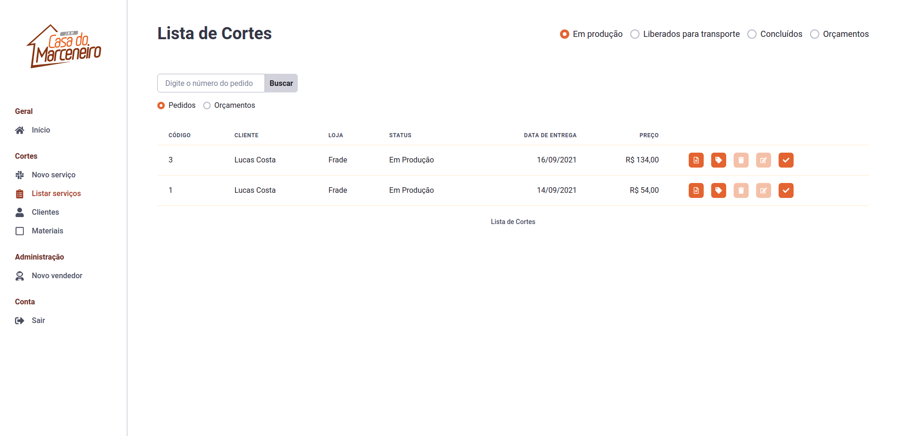

# JRM Compensados

App developed with Typescript, Nextjs and Firebase to manage the company JRM Compensados. It's the second edition of the app that I developed to manage our company sector. The idea was to create a way to make easier the communication between production and sellers.

## Live Preview

[Live Preview](https://jrm-app-live-preview.vercel.app/)

username: teste@teste.com

password: 12345678

Made by Mateus Alcantara 👋 &nbsp;[See my linkedin](https://www.linkedin.com/in/mat-alcantara/)
